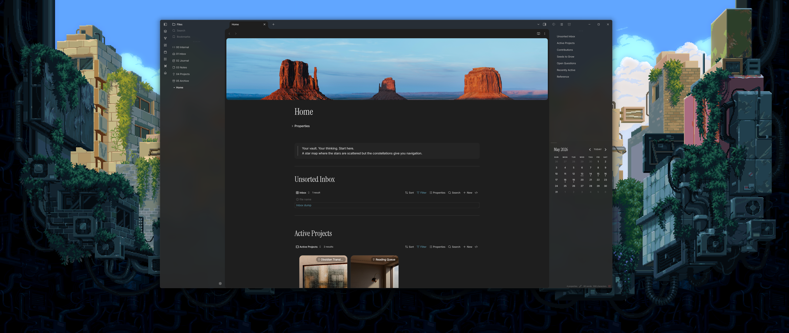
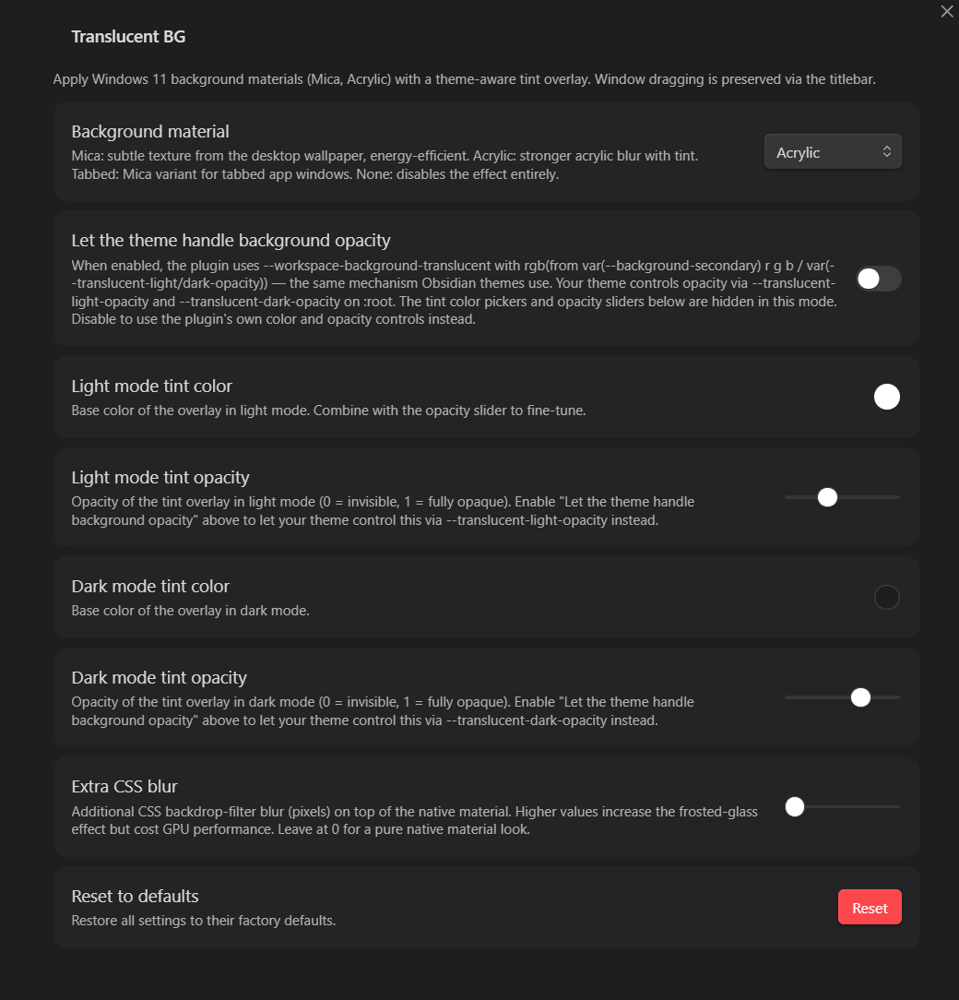

# Obsidian Translucent BG

An [Obsidian](https://obsidian.md) plugin for **Windows** that applies native Windows 11 background materials (Mica, Acrylic, Tabbed) to the Obsidian window. Unlike a fixed aesthetic theme, Translucent BG is built around **theme compatibility and full customization**, it works with any Obsidian color theme and gives both users and theme authors precise control over how the translucency looks.

> **Windows only.** Requires Obsidian running as a native desktop app on Windows 10/11 with a version of Electron that supports `BrowserWindow.setBackgroundMaterial`.

---

## Preview

### Plugin-managed tinting - Mica

*Mica material, plugin-managed tinting (user picks color and opacity directly in settings).*


### Plugin-managed tinting - Acrylic

*Acrylic material, plugin-managed tinting - stronger frosted-glass effect than Mica.*



### Theme-managed tinting - same material, different color schemes

*Theme-managed mode: the plugin defers tint color and opacity entirely to your Obsidian theme. Swap themes, and the translucency adapts automatically. Shown here with Mica and three different color schemes - default, Catppuccin, and Everforest.*

| Default | Catppuccin | Everforest |
|---|---|---|
|  |  |  |

### Plugin-managed - Acrylic, dark theme

*Plugin-managed tinting on a dark theme. All three materials are available.*


### Settings



---

## Two ways to control the tint

Translucent BG ships with two tinting modes. Both produce the same result - the difference is **who controls it**.

### Plugin-managed (default)

The plugin owns the tint. You pick a hex color and opacity for light and dark mode independently in settings. The tint is always there regardless of which theme is active.

**Best for:** users who want a consistent look across all themes, or who prefer sliders and color pickers.

### Theme-managed

The plugin defers tint color and opacity entirely to your active Obsidian theme. Tint color is derived from your theme's `--background-secondary`, and opacity is controlled via `--translucent-light-opacity` and `--translucent-dark-opacity` on `:root`. Swap to a different theme and the translucency automatically matches.

**Best for:** theme authors who want translucency to feel native to their palette, and users who are happy with a theme's existing design.

```css
/* Theme authors: add this to your theme's snippet and opacity is yours to control */
:root {
  --translucent-light-opacity: 50%;
  --translucent-dark-opacity:  50%;
}
```

---

## Features

- **Three Windows 11 materials** - Mica, Acrylic, and Tabbed via the native Electron API
- **Two tinting modes** - plugin-managed (sliders + color pickers) or theme-managed (theme controls everything)
- **Theme compatibility** - theme-managed mode produces the exact same `--workspace-background-translucent` expression Obsidian themes use natively, so it integrates without conflict
- **Auto theme switching** - tint reacts instantly when you switch between light and dark themes
- **Extra CSS blur** - optional `backdrop-filter` blur stacked on top of the native material
- **Cycle command** - keyboard command and ribbon icon to cycle through materials without opening settings
- **Clean unload** - all CSS modifications reversed when the plugin is disabled

---

## Installation

### Manual

1. Download the latest release from the [Releases](https://github.com/MellowMarsh-Git/Obsidian-Translucent-BG/releases) page.
2. Copy `main.js`, `styles.css`, and `manifest.json` into your vault at:
   ```
   <vault>/.obsidian/plugins/translucent-bg/
   ```
3. Enable the plugin in **Settings → Community plugins**.

### From source

```bash
git clone https://github.com/MellowMarsh-Git/Obsidian-Translucent-BG.git
cd Obsidian-Translucent-BG
npm install
npm run build
```

Then copy `main.js`, `styles.css`, and `manifest.json` into your vault's plugin folder as above.

---

## Settings

| Setting | Description |
|---|---|
| **Background material** | Mica, Acrylic, Tabbed, or None |
| **Let the theme handle background opacity** | Toggle between plugin-managed and theme-managed tinting |
| **Light mode tint color** | Tint color in light mode *(plugin-managed only)* |
| **Light mode tint opacity** | Tint opacity in light mode, 0–1 *(plugin-managed only)* |
| **Dark mode tint color** | Tint color in dark mode *(plugin-managed only)* |
| **Dark mode tint opacity** | Tint opacity in dark mode, 0–1 *(plugin-managed only)* |
| **Extra CSS blur** | Additional `backdrop-filter` blur in pixels (0–40 px) |
| **Reset to defaults** | Restore all settings to factory defaults |

When **Let the theme handle background opacity** is enabled, the color and opacity controls are hidden - they have no effect in that mode.

---

## Commands

| Command | Description |
|---|---|
| `Translucent BG: Cycle background material` | Cycles Mica → Acrylic → Tabbed → None → Mica |
| `Translucent BG: Open Translucent BG settings` | Opens the plugin's settings tab directly |

A ribbon icon (stacked layers) also triggers the cycle command.

---

## How it works

### Plugin-managed mode (default)

1. The plugin calls `BrowserWindow.setBackgroundMaterial(material)` via Electron to apply the chosen Windows 11 material.
2. Obsidian's `is-translucent` class is added to `<body>` and `--workspace-background-translucent` is set to `transparent`, letting the native material show through.
3. A full-screen `<div id="translucent-bg-overlay">` at `z-index: -1` carries the tint color and optional extra blur.
4. A `MutationObserver` watches `<body>` class changes and updates the tint instantly when you switch themes.

### Theme-managed mode

1. The overlay div is hidden - it is not used for tinting here.
2. `--workspace-background-translucent` is set to the `rgb(from …)` expression that Obsidian's own translucency system uses:
   - Light: `rgb(from var(--background-secondary) r g b / var(--translucent-light-opacity, 50%))`
   - Dark: `rgb(from var(--background-secondary) r g b / var(--translucent-dark-opacity, 50%))`
3. Obsidian's own `is-translucent` shell reads `--workspace-background-translucent` and applies it as the workspace background - the same way native Obsidian themes work.
4. The plugin never writes `--translucent-light-opacity` or `--translucent-dark-opacity` as inline styles, so your theme's `:root` declarations always take effect.

---

## For Theme Authors

In theme-managed mode the plugin produces exactly the same workspace background as native Obsidian translucency. To take full control, add this to your theme (or an accompanying snippet):

```css
:root {
  /* Adjust opacity to taste - 50% is a good starting point */
  --translucent-light-opacity: 50%;
  --translucent-dark-opacity:  50%;
}
```

The **tint color** is automatically derived from your theme's own `--background-secondary`, so it always matches your palette with no extra configuration.

In plugin-managed mode the plugin exposes two informational variables for themes or snippets that want to read the current state:

```css
--tbg-tint-color   /* rgba() of the current plugin-managed tint */
--tbg-extra-blur   /* current extra blur amount, e.g. "0px"   */
```

---

## Building

```bash
npm install       # install dev dependencies
npm run dev       # development build (source maps, no minification)
npm run build     # production build  (minified, no source maps)
```

Output is `main.js` at the project root.

---

## License
[[LICENSE|MIT license]]
